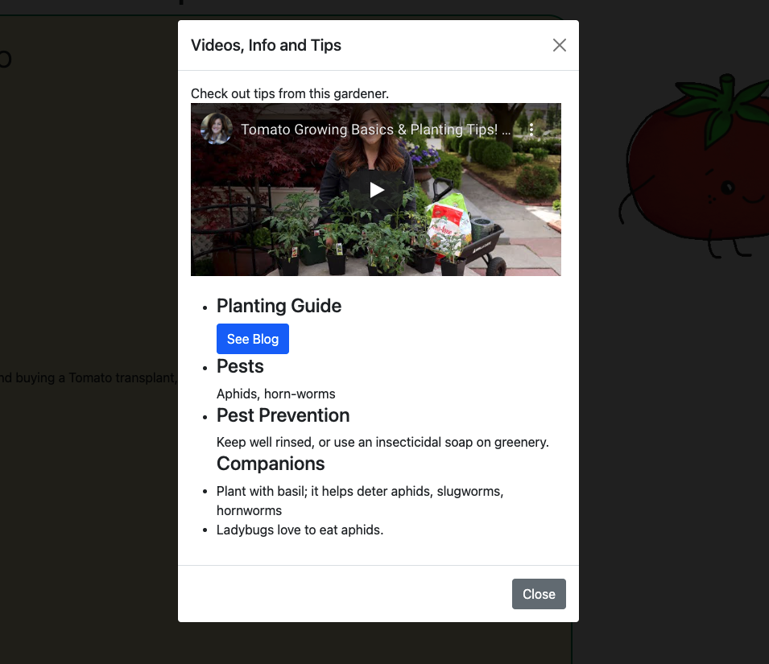
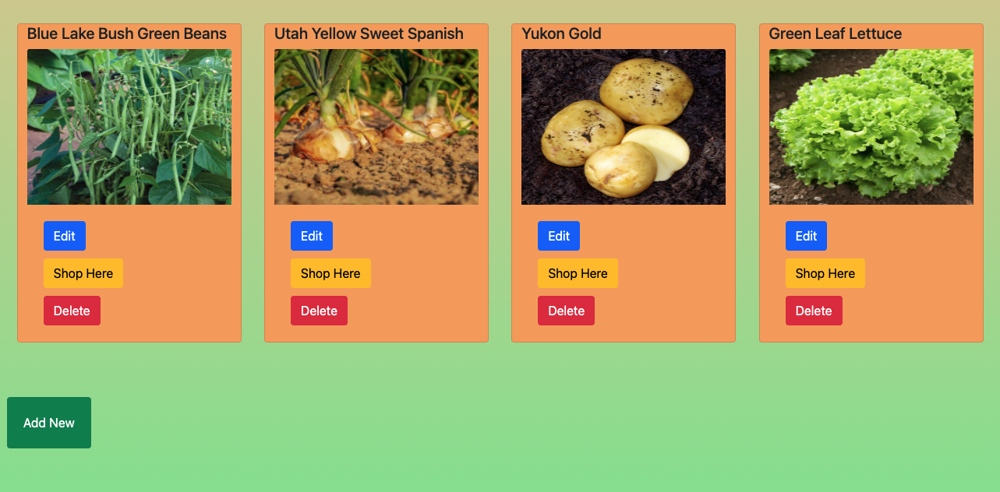

#Welcome to the Garden Planner App!
#### gardenPlannerApp

###Link To Webpage:
https://evening-fjord-81831.herokuapp.com/gardenPlanner/Plant

A user can click on one of the plant cards, and view comprehensive data about selected plant top pick recommendation, and more.
This is an interactive website that pulls custom data for best recommended plants and all of their info, for a gardener to review. Any gardener can work to add plant *cards* with a link to *purchase* from outside URLs to the *Variety* catalog for future reference. The goal for this website was to provide a gardener with a *one-stop-shop* to read about any and all info related to buying, picking, planting, and harvesting their favorite plants. For my top 5 picks/favorites for containers, I have supplied the user with an opportunity to quickly find easy links for online blog/resources, as well as tutorial videos I have found useful for growing my own gardeing skills.

###MVP and User Engagement
I designed this website with all kinds of gardeners in mind. For a user who plans to garden for the season using pots and containers in their backyard or on the patio, I have recommended 5 of my favorite plant varieties that fair well in pots, across 5 major veggie families:
    -Tomatoes
    -Greens
    -Potatoes
    -Onions
    -Vining(Beans)
A user can navigate from the home page to a "containers and pots" page to display my top 5 plant recommendations. From there, the user can *see more* and navigate to a card page that displays a variety recommendation and so much more.

  

##Viewing and User Engagement

This project showcases plant and variety information only for gardening in containers and pots. The database I have created and connected to this website pulls custom data per my top 5 plant picks and displays it using Bootstrap Cards and Modals. See Below:

###Cards:

  

###Modals:

  

Users can also access the "Varieties Catalog" and using RESTful back-end model,  can *Edit*, *Add*, or *Delete* any of the plant cards listed. As a user, this site welcomes additions and edits to the catalog to help other users find/source new container planting ideas. See below a route that demos a part of the CRUD functionality. 

  

  

###Tools/Design

This site was built with Bootsrap, as well as Nodejs frameworks with MongoDB, EJS templating, Javascript, HTML and CSS. It has been deployed on Heroku and linked at the top of this readME.

###Stretch Goals/Hurdles/Future Plans

Hurldes in this 2 week project development included learning and fully utilizing Bootstrap for function and styling. With more time, I hope to improve my web-accessibility features, expand use of an API like the USDA Seeds API, make user accounts, and finish building out my filtering buttons for gardening in the ground or raised beds vs containers.

--Stretch goal using more than one model and use of Bootstrap Modals.

--Stretch goals I did not have enough time to meet: 
    --using a USDA seed API to source some additional data
    --building out other collections for my raised beds or ground filtering buttons
    --activating a search-bar feature with my NavBar.

###Final Comments

I hope to see many users add to the Plant catalog! Cheers, and Happy Gardening.