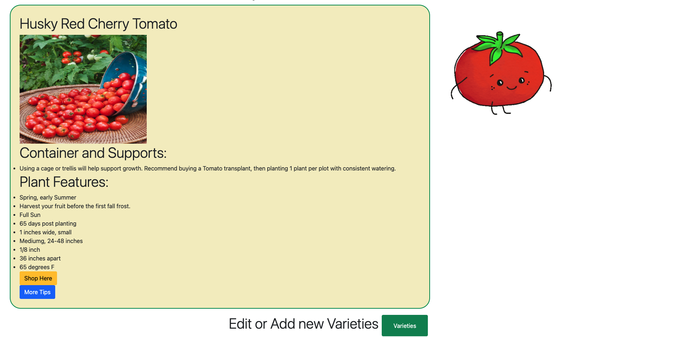
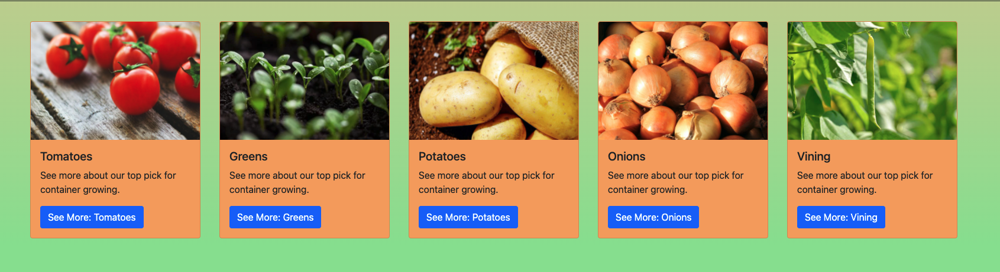
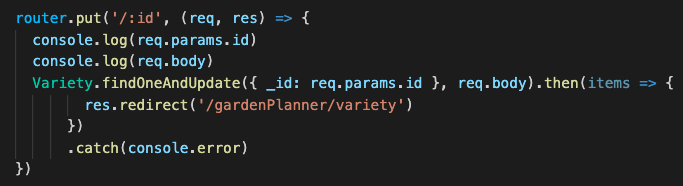

# gardenPlannerApp

#Link To Webpage:
https://evening-fjord-81831.herokuapp.com/gardenPlanner/Plant

Welcome to the Garden Planner App!
This is an interactive website that pulls custom data for best recommended plants and all of their info, for a gardener to review. Any gardener can work to add plant "cards" to the "variety" catalog for future reference. The goal for this website was to provide a garderner with a *one-stop-shop* to read about any and all info related to buying, picking, planting, and harvesting their favorite plants. For my top 5 picks/favorites for containers, I have supplied the user with an opportunity to quickly find easy links for online blog/resources, as well as tutorial videos I have found useful for growing my gardeing skills.

This project showcases plant and variety information only for gardening in containers and pots. 
  

MVP:
As a user who plans to garden the season using pots and containers in their backyard or on the patio, I have recommended 5 favorite plant varieties that fair well in pots, across 5 major veggie families:
    -Tomatoes
    -Greens
    -Potatoes
    -Onions
    -Vining(Beans)

  

A user can click on one of the plant cards, and view comprehensive data about selected plant top pick recommendation, and more.

Users can also access the "Varieties Catalog" and using RESTful frameworks, Edit, Add, or Delete any of the plant cards listed. As a user, this site welcomes additions and edits to the catalog to help other users find/source new container planting ideas.
  

This entire site was built with Bootsrap5 as well as frameworks such as MongoDB, EJS templating, Javascript, HTML and some CSS.

My Biggest Hurdles to developing this were definitly related to learning Bootstrap and expanding my use of Views/EJS. With more time, I hope to improve my web-accessibility features, expand use of an API like the USDA Seeds API, and finish building out my filtering buttons such as gardening in the ground or raised beds.

Stretch goal: using more than one model.
Stretch goals I did not have enough time to meet: 
    -using a USDA seed API to source some additional data
    -building out other collections for my raised beds or ground filtering buttons
    -activating a search-bar feature with my NavBar.